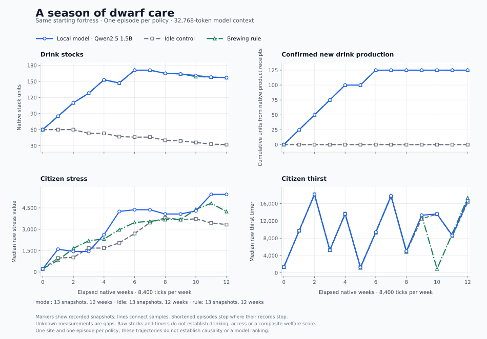

# One season with a local model

On **2026-09-06 UTC**, a local Qwen2.5-1.5B model, an idle control and a brewing rule each completed three in-game months from the same recorded starting fortress. The model produced valid decisions throughout and queued jobs that made real drinks. It chose the same action sequence as the simple rule. This experiment does **not** demonstrate better dwarf care or decisions that adapt to changing conditions.

[Download the derived measurements and source hashes](data/native-care-season.json), or the [three-run CSV summary](data/native-care-season.csv). The figure includes all 13 native snapshots per policy; model and rule production curves overlap. The published data are derived measurements, not a complete raw replay or a saved fortress; they do not include the game, model weights or private runtime logs.

## Setup

| Setting | Recorded value |
| --- | --- |
| Game / bridge | Dwarf Fortress 53.16, Windows ITCH build / DFHack 53.16-r1.1 |
| Model | Qwen2.5-1.5B-Instruct, Q4_K_M GGUF |
| Model runtime | Ollama 0.33.3; CPU only; four threads; f16 KV cache |
| Host | Intel Core i5-1335U laptop, Windows; other activity was present |
| Context | 32,768 tokens configured and reported loaded |
| Generation ceiling | 8,192 tokens per call; 98,304 across the episode |
| Sampling | Temperature 0; seed 17; thinking disabled |
| Observation contract | `native-care-v1`; current projected snapshot plus prior validated public decisions |
| History | Up to 12 prior decisions; all 0–11 available prior decisions were retained |
| Horizon | 12 decisions × 8,400 native ticks = 100,800 ticks, or 12 weeks |
| Native clock | 20,178,138 → 20,278,938 in every episode |
| Requested simulation cap | 1,000 FPS; actual advance throughput is reported separately below |
| Wall-time / request ceiling | 7,200 seconds per episode / 2,400 seconds per model request |

The model had only `wait`, `brew` and `finish`. A brew action queues normal brew-from-plant jobs at a completed Still and advances the same fixed interval as waiting. It does not create drinks directly or guarantee that a job completes. The initial site had seven citizens, 60 drink units, a completed Still, brewing ingredients and containers.

The checkpoint fingerprint, initial native observation, first policy input, recorded game configuration and experiment budgets matched across the three episodes. Native initial-state guards passed before policy evaluation. The controls had different policies and made no model calls. Matching these records does not establish identical unobserved state or deterministic simulation.

All three episodes reached the full horizon, ended at `max_decisions`, and confirmed both final pause and restoration of the original simulation cap. The model ran from 01:05:42 to 01:50:11 UTC; idle from 01:53:26 to 01:57:15; rule from 02:01:07 to 02:04:26.

## Actions, products and care

| Policy | Accepted actions | Jobs queued | Jobs with confirmed drink products | Confirmed new drink units | Drink stock, start → end |
| --- | --- | ---: | ---: | ---: | ---: |
| Model | 12 × `brew`, Still 1, quantity 1 | 12 | 5 | 125 | 60 → 157 |
| Idle | 12 × `wait` | 0 | 0 | 0 | 60 → 32 |
| Brewing rule | 12 × `brew`, Still 1, quantity 1 | 12 | 5 | 125 | 60 → 157 |

The model and rule emitted **identical action/workshop/quantity sequences**. Their public explanations differ, but those explanations do not change the executed action. All 12 model responses were accepted, with no invalid or failed model calls.

Production counts come from validated native product callbacks tied to queued brew jobs. In each brewing episode, five jobs created five stacks of 25 drink units. The other **seven queued jobs had no recorded drink output by the end**; their causes remain unexplained. This is not evidence that all 12 jobs completed. Receipt validation found no dropped events, dropped outputs, hook errors, invalid evidence records or unknown product quantities.

Final stock equals starting stock plus confirmed production minus 28 units in each episode. That stock balance does not establish consumption, individual access to drinks, or where the units went. The recording contains production evidence, not drinking receipts.

| Policy | Population, start → end | Observed confirmed deaths | Stress median, start → end | Thirst timer median, start → end |
| --- | ---: | ---: | ---: | ---: |
| Model | 7 → 7 | 0 | 220 → 5,452 | 1,338 → 16,667 |
| Idle | 7 → 7 | 0 | 220 → 3,330 | 1,338 → 16,303 |
| Brewing rule | 7 → 7 | 0 | 220 → 4,244 | 1,338 → 17,342 |

These are raw native measurements. The chart and data contain no composite welfare score. Death counts require an observed native dead flag; a disappearing citizen is not inferred dead.

The model and rule received matching recorded starts and took the same actions, yet their care trajectories differed. **Replay repeatability remains unresolved.** One episode per policy cannot estimate variation across repeated identical runs or identify the cause of this divergence. The endpoint differences do not establish that one policy took better care of the dwarves.

The model repeated the same public reason on all 12 turns and repeatedly described its activity as “brewing Fish.” That ingredient claim is wrong: accepted queue results and product receipts identify `BREW_DRINK_FROM_PLANT`. The reaction name alone does not establish the plant species. Structurally valid output and successful job execution therefore coexist with an inaccurate explanation. The constant brew schedule also leaves sensitivity to changing game state unproven.

## Context, caching and runtime

The configured 32,768-token window was capacity. The largest reported prompt contained **9,106 tokens**. The model generated **2,392 tokens total**, with a maximum of **207 in one response**, despite its 8,192-token allowance. The experiment does not test behavior near a full 32K context boundary.

| Policy | Episode wall seconds | Native ticks/s while advancing | Native ticks/s across the episode |
| --- | ---: | ---: | ---: |
| Model | 2,668.890 | 490.33 | 37.77 |
| Idle | 229.141 | 445.28 | 439.90 |
| Brewing rule | 198.813 | 515.52 | 507.01 |

Model prompt evaluation took **2,107.72 seconds** and generation took **345.32 seconds**. Native decoding throughput was **6.93 tokens/s**; generated tokens divided by full policy-call time was **0.97 tokens/s**. The difference is mostly prompt processing. These shared-laptop timings are observations, not a controlled hardware comparison.

Caching was active: 11 of 12 calls reported reuse. Across the episode, Ollama reported **13,862 cached prompt tokens out of 88,470 prompt tokens** (15.7%). Turn 12 reused **2,179 of 9,084** prompt tokens (24.0%); the backend log independently records the same cached count and 6,905 newly processed prompt tokens. These are counters from the same runtime, not separate hardware measurements.

The current observation projection removes session and epoch identifiers. Its sorted JSON places history before the current observation, allowing the unchanged earlier history to form a reusable prefix. Appending another history entry changes the following suffix, including the current observation. The observed reuse is therefore partial, with most prompt tokens still processed anew. [Ollama counter definitions](https://docs.ollama.com/api/chat) and [llama.cpp prefix-cache behavior](https://github.com/ggml-org/llama.cpp/blob/master/tools/server/README.md) describe these distinctions.

A stable-prefix or delta representation is a candidate for measurement. It has not been benchmarked here, and no 10× speedup is established. Turn 12 spent **212.49 seconds on prompt evaluation and 33.62 seconds on generation**. An encoding comparison must measure both stages and whole-call latency.

## What this establishes and what comes next

This is a completed, inspectable native control experiment: valid local model calls led to real game actions, time advances, product receipts and care measurements. It establishes neither a model ranking nor improved welfare over the controls. Context, generation allowance, retained history and duration all differ from the [earlier care pilot](native-care-pilot.md), so their effects cannot be separated by comparing those two experiments.

The next acceptance milestone is a short positive control: a prepared care problem where a scripted useful intervention reliably changes a predefined native care endpoint relative to idle. Idle still had 32 drink units at this experiment's end, so it did not demonstrate a shortage that brewing needed to resolve.

Repeat the same fixed action schedule from the same checkpoint to measure replay variation, inspect the seven jobs without observed products, and test whether controlled changes in needs and resources lead to appropriate model decisions. A separate replay of recorded inputs can measure cache improvements without involving game variability. Any new observation representation needs its own version and a check that it preserves the intended information. These are planned checks, not completed features; see the [validation roadmap](../PROJECT_DIRECTION.md#next-acceptance-milestone).

The original plan SHA-256 is `05a23d2ce9b7dcf9334be2e0acfaf7b50c9815ef1820588ffdc8184001ceeb99`. Per-episode manifest and event-log SHA-256 values are included in the [published data](data/native-care-season.json). Those fingerprints identify the original local evidence used to derive this report; they do not make the complete private ledgers or starting save part of this publication.
